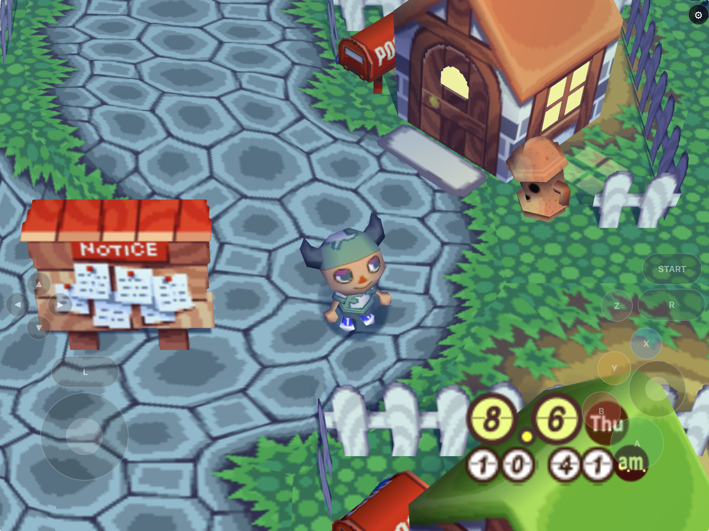
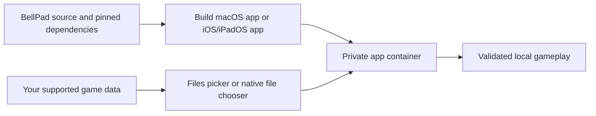
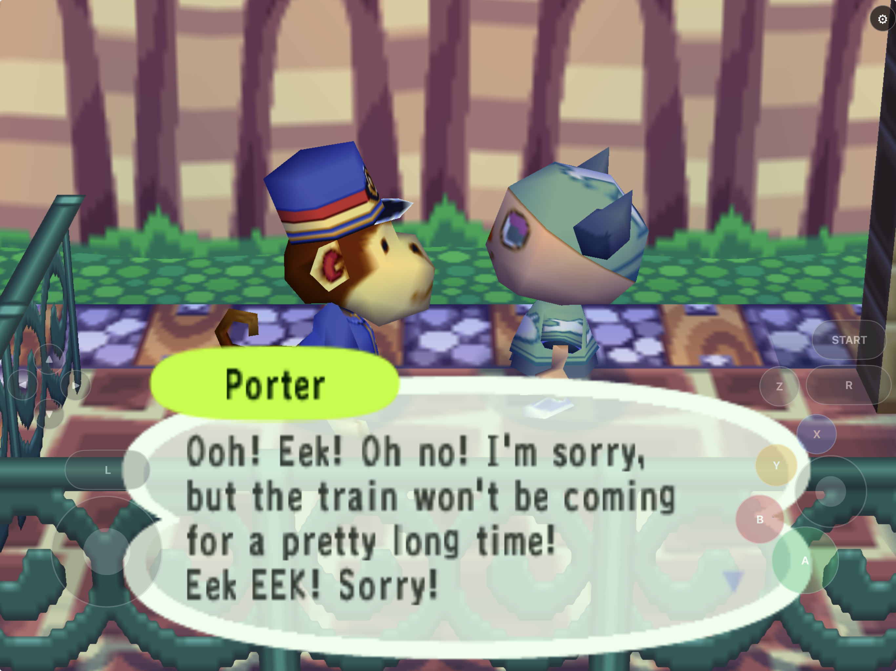
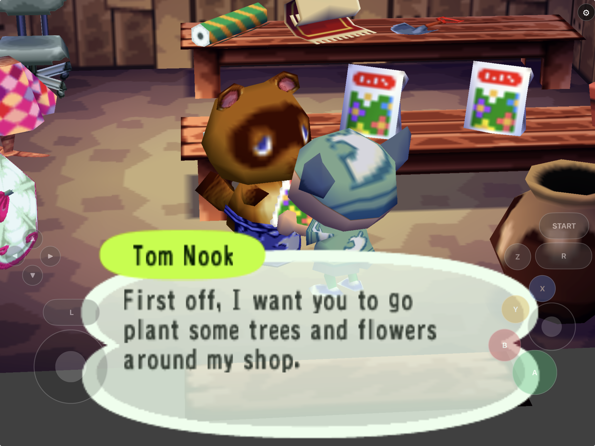

# BellPad

<p align="center">
  <strong>Animal Crossing rebuilt as a native Apple Silicon source port for macOS, iPhone, and iPad.</strong><br>
  Native Metal rendering, touch controls, Files-based game-data import, and Dolphin-compatible saves.
</p>

<p align="center">
  <a href="https://github.com/chrissotraidis/bellpad/actions/workflows/source-release.yml"></a>
  
  
  
  
</p>



BellPad is an experimental native Apple-platform source port for the original
US release of Animal Crossing for Nintendo GameCube. It is not a GameCube
emulator or a browser port. The project builds a 64-bit, reverse-engineered
game core for Apple Silicon macOS and a Metal-backed iPhone/iPad app through
[Aurora](https://github.com/encounter/aurora), SDL3, and Dawn. Its game foundation
is [birabittoh/ACGC-PC-Port](https://github.com/birabittoh/ACGC-PC-Port), based on
[FlyingMeta’s PC port](https://github.com/flyngmt/ACGC-PC-Port) and
[ACreTeam/ac-decomp](https://github.com/ACreTeam/ac-decomp). BellPad contributes
the Apple integration, native import/input/save handling, and compatibility fixes.

This repository contains source, original BellPad integration, reproducible
build scripts, and documentation. It does **not** contain Animal Crossing, a
GameCube image, extracted game assets, or saves. You supply your own legally
obtained, supported game data locally after building or installing BellPad.
Read the scoped [legal and clean-room boundary](docs/LEGAL.md) before using or
contributing to the project.

## Download

[**Download BellPad 0.1.0 Preview 2 for iPhone and iPad (.ipa)**](https://github.com/chrissotraidis/bellpad/releases/download/v0.1.0-preview.2/Bellpad-0.1.0-preview.2-unsigned.ipa)

This is an experimental, unsigned, ROM-free preview for ARM64 devices running
iOS or iPadOS 17.0 or later. You must sign it with your own Apple identity
before installation and provide your own supported game data after launch. It
is not an App Store or TestFlight release.

Preview 2 asset: `Bellpad-0.1.0-preview.2-unsigned.ipa`, SHA-256
`d9e9ebd5d17fa360de1775cf60deaccd8ca5b196b09842ea633a8ad353a8aaea`.

## Release status

| Option | Status | What it means |
|---|---|---|
| Apple Silicon macOS | **Playable baseline** | The native `Bellpad.app` reaches a generated town, creates/reloads a Dolphin-compatible GCI save, and has desktop rendering/input evidence. |
| iPhone and iPad Simulator | **Current development target** | Files import, retained game data, Metal rendering, touch input, native name entry, save import/export, and relaunch have evidence on sequential Simulator runs. |
| ARM64 iPhone/iPad device build | **Physical iPad validated** | Version 0.1.0 build 2 was signed, installed in place, and reached the retained-image/save-backed title on iPad. Game data, saves, controller settings, and touch preferences were byte-identical after readback. Physical controller scenarios remain acceptance gates. |
| GitHub release | **Unsigned preview available** | Download the ROM-free IPA above, sign it with your own Apple identity, and provide your own supported game data after launch. |
| App Store / TestFlight | **Not available** | BellPad is not store-distributed. |

The source-release workflow verifies the clean-room and reproducibility gates
on Apple ARM64. It is not a substitute for hands-on hardware gameplay,
long-session stability, or every game activity. The player-visible defect
register and outstanding device checks live in [TECH_DEBT.md](docs/TECH_DEBT.md).

## Get started

You need:

- an Apple Silicon Mac with Xcode and Command Line Tools;
- Homebrew, Git, CMake, Ninja, ripgrep, and SDL2; and
- your own legally obtained, supported GameCube data for Animal Crossing.

Clone, validate the source release, and build the iOS Simulator app:

```sh
git clone --recurse-submodules https://github.com/chrissotraidis/bellpad.git
cd bellpad
brew install cmake ninja ripgrep sdl2
./scripts/verify-release-candidate.sh
./scripts/build-aurora-game-ios-simulator.sh
```

The game and Aurora are maintained in pinned submodules under `source/`.
The first build also fetches hash-pinned third-party dependencies; it does not
download game data. See [source maintenance](docs/SOURCE_MAINTENANCE.md) for
the exact fork pins, update procedure, source delivery, and rollback. Install the resulting
`Bellpad.app` in one booted Simulator, launch it, and use Files to select your
own supported raw ISO/GCM. Run iPhone and iPad Simulator sessions separately.

For the native macOS baseline, run:

```sh
./scripts/build-playable-macos-app.sh
```

For the unsigned ARM64 device product, use
`./scripts/build-aurora-game-ios-device.sh`; packaging is described in
[BUILDING.md](docs/BUILDING.md). A device build is not a generally installable
download without your own signing and hardware validation.

## First launch and game data

BellPad never downloads, bundles, or distributes game data. The currently
supported compatibility target is the original US revision:

| Game ID | Region | Revision | Accepted application input |
|---|---|---|---|
| `GAFE01` | USA | 0 | Validated raw ISO/GCM at the verified full or trimmed size |

On macOS, the app asks for the image once with a native file chooser and
remembers it, so later launches start straight into the game. Run it with
`--choose-disc` to pick a different image, or `--disc PATH` to use one for a
single run. BellPad stores only a local reference to the file you picked; it
never copies the image into the app or the data directory.

On iPhone and iPad, select the file in Files. BellPad validates the header,
revision, size, and streamed fingerprint; stages a private Application Support
copy; validates it again; then installs it atomically for subsequent launches.
An invalid selection does not replace a retained valid image. Compressed
formats, including CISO/RVZ, remain unsupported in the application flow.



The game data and generated save files stay local. Do not add them to Git,
issues, pull requests, documentation, CI artifacts, app bundles, or packages.

## Touch controls and input

BellPad's native mobile layout includes the left and C sticks, D-pad,
A/B/X/Y, Z/L/R, and Start. It adapts between compact iPhone and larger iPad
layouts and respects safe areas. The reviewed build 5 candidate uses a native
three-dot menu with Display, Controls, Game Data & Saves and diagnostics. These
changes are not in the public Preview 2 download yet.

- **Controls:** hide/show gameplay controls, adjust opacity and global size,
  move controls, resize an individual selected control, and reset the active
  device-class layout. The candidate adds a touch-stick dead zone, optional
  button haptics and a choice to retain touch controls with a controller attached.
  Existing positions/preferences and default stick response are preserved.
- **Render scale:** choose Native, 1×, 2×, 3×, or 4× internal rendering.
  This changes sharpness, not the fixed 60 Hz game simulation.
- **Controllers:** Aurora's SDL3 manager owns physical controllers and stable
  player slots; touch remains a separate virtual input for player 1. Stored
  handles are reconciled against current devices on events, foreground resume,
  and a bounded active check. Deterministic sleep/reconnect coverage passes;
  Bluetooth, wired, natural-sleep, mapping, and two-controller hardware tests
  remain open.
- **Text entry:** the native UIKit editor bridges typed text, Backspace, paste,
  and Done to the game thread. Simulator coverage exists; physical keyboard
  transitions still need acceptance testing.

The candidate's **Report a Problem** flow includes the app/source build, bounded
current/previous session logs, repeated runtime warning counts, import/save/audio
and lifecycle breadcrumbs, frame-loop health and current technical settings. It
is also available before import. No automatic upload occurs; game images, save
contents, typed game text and signing material are excluded. See
[diagnostics and controls](docs/DIAGNOSTICS_AND_CONTROLS.md) for limits and tests.

The desktop baseline also supports keyboard mappings; see
[BUILDING.md](docs/BUILDING.md) for the complete control, signing, product-path,
and package-audit workflow.

## Current screenshots

<table>
  <tr>
    <td width="50%">
      
    </td>
    <td width="50%">
      
    </td>
  </tr>
  <tr>
    <td align="center"><strong>Arrival</strong><br>Native dialogue and touch overlay during the train sequence.</td>
    <td align="center"><strong>Town life</strong><br>The Nook shop sequence running through the Metal-backed app.</td>
  </tr>
</table>

These are current gameplay captures made with locally supplied game data. They
are documentation only: no game image, extracted asset, save, or derived
archive is included in this repository or in BellPad build products.

## What works today

| Area | Current evidence |
|---|---|
| Native core | 64-bit Apple Silicon macOS core and the complete Aurora/SDL3/Dawn game target build from pinned sources. |
| Rendering | Desktop OpenGL is the behavior baseline; Aurora/Metal renders the title, train/station flow, dialogue, populated inventory item icons, and representative outdoor-town scenes. |
| Saves | Canonical GCI creation/reload, atomic replacement, rolling backups, isolated Dolphin GCI-folder interchange, and Simulator import/export have evidence. |
| Game-data flow | Raw ISO/GCM validation, private retention, reimport/removal, and retained relaunch work in the mobile app. |
| Input | Native touch, desktop keyboard, native mobile setup text, stabilized discrete submenu navigation, and SDL3 controller slot/reconnect reconciliation have focused test evidence. |
| Packaging | The unsigned ARM64 iOS package is reproducible and audited to contain no game data, save, certificate, provisioning profile, or private key. |

See [STATUS.md](docs/STATUS.md) and [TESTING.md](docs/TESTING.md) for dated
evidence and [PLAN.md](docs/PLAN.md) for the remaining implementation plan.

## Known limitations

- This is an experimental source port, not a finished commercial product.
- Broader physical-device lifecycle, long-session stability, audio-route
  behavior, keyboard transitions, physical controller sleep/reconnect/mapping,
  and scene coverage remain acceptance gates.
- A reported repeated-action symptom is not reproduced in the corrected
  Simulator traces; broader short-tap coverage across doors, dialogue, and
  inventory actions remains useful regression testing.
- Interiors, broader outdoor comparison, complete editor coverage, compressed
  game-data formats, NES-furniture runtime output, and full sanitizer gameplay
  coverage remain open.

The full, player-visible list is maintained in [TECH_DEBT.md](docs/TECH_DEBT.md).

## Project map

| Path | Purpose |
|---|---|
| [`scripts/verify-release-candidate.sh`](scripts/verify-release-candidate.sh) | Source-release audit: tracked content, maintained pins, tests, shell syntax, and whitespace. |
| [`scripts/build-playable-macos-app.sh`](scripts/build-playable-macos-app.sh) | Native Apple Silicon macOS game baseline. |
| [`scripts/build-aurora-game-ios-simulator.sh`](scripts/build-aurora-game-ios-simulator.sh) | Native iPhone/iPad Simulator product build. |
| [`scripts/build-aurora-game-ios-device.sh`](scripts/build-aurora-game-ios-device.sh) | ARM64 iPhone/iPad device product build. |
| [`scripts/package-unsigned-ipa.sh`](scripts/package-unsigned-ipa.sh) | Reproducible unsigned IPA build and package audit. |
| [`docs/BUILDING.md`](docs/BUILDING.md) | Detailed build, product-path, signing, install, and packaging instructions. |
| [`docs/TESTING.md`](docs/TESTING.md) | Test matrix and dated runtime evidence. |
| [`docs/TECH_DEBT.md`](docs/TECH_DEBT.md) | Player-visible defects and physical-device acceptance gates. |
| [`docs/LEGAL.md`](docs/LEGAL.md) | Clean-room, data, branding, and licensing boundary. |

Generated source trees, build directories, game data, extracted assets, saves,
signed apps, packages, and credentials are ignored and must never be committed.

## Research, credits, and legal

BellPad is an unofficial community compatibility project. It is not affiliated
with or endorsed by Nintendo. Animal Crossing, Nintendo, and GameCube names
are used only to describe compatibility; their trademarks and copyrighted works
remain their owners' property.

The project builds on the work of
[ACreTeam/ac-decomp](https://github.com/ACreTeam/ac-decomp),
[flyngmt/ACGC-PC-Port](https://github.com/flyngmt/ACGC-PC-Port),
[birabittoh/ACGC-PC-Port](https://github.com/birabittoh/ACGC-PC-Port),
[encounter/aurora](https://github.com/encounter/aurora),
[ACreTeam/forest](https://github.com/ACreTeam/forest), and their contributors.
Exact pins, licenses, purposes, and modifications are recorded in
[RESEARCH.md](docs/RESEARCH.md), [upstreams.lock.json](upstreams.lock.json),
[product-dependencies.lock.json](product-dependencies.lock.json), and
[THIRD_PARTY_NOTICES.txt](THIRD_PARTY_NOTICES.txt).

This repository is mixed-license and source-available; it does not grant a
license to retail game data, extracted assets, trademarks, or material whose
rightsholders have not granted one. See [LICENSE](LICENSE) and
[LEGAL.md](docs/LEGAL.md). This documentation is project policy, not legal
advice.

## Contributing

Contributions must have clear authorship, compatible licensing, reproducible
test evidence, and preserve the clean-room boundary. Do not submit game data,
extracted assets, saves, certificates, provisioning profiles, credentials, or
private keys.

Before opening a change, read the project docs and run the affected checks. For
a source-only release gate, run:

```sh
./scripts/verify-release-candidate.sh
```
